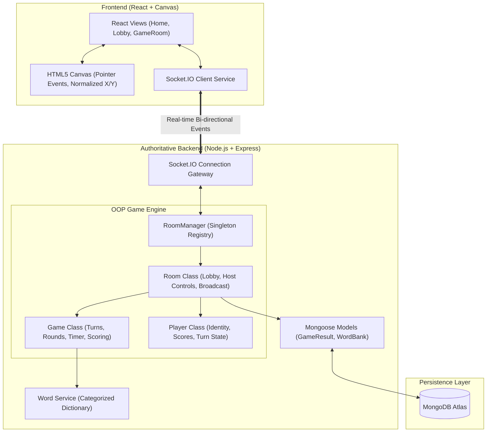

# 🎨 Skribbl.io Clone - Full-Stack Real-Time Multiplayer Drawing & Guessing Game

> An end-to-end, production-ready, interview-grade clone of **skribbl.io** built with **React (Vite)**, **Node.js (Express)**, **Socket.IO**, **HTML5 Canvas**, and **MongoDB Atlas**.

---

## 🌟 Live Demo & Deployment

- **Live Application URL:** [https://skribbl-clone-prod.onrender.com](https://skribbl-clone-prod.onrender.com) *(Configure your Render / Railway deployment URL here)*
- **Backend API Health:** `GET /api/health`

---

## 📖 Table of Contents
1. [Project Overview](#-project-overview)
2. [Key Features](#-key-features)
3. [Tech Stack](#-tech-stack)
4. [System Architecture](#-system-architecture)
5. [Directory Structure](#-directory-structure)
6. [Game Flow & Mechanics](#-game-flow--mechanics)
7. [Canvas & Real-Time Synchronization](#-canvas--real-time-synchronization)
8. [Socket.IO Event Architecture](#-socketio-event-architecture)
9. [Authoritative State & Anti-Cheat](#-authoritative-state--anti-cheat)
10. [Database Design](#-database-design)
11. [Local Setup Instructions](#-local-setup-instructions)
12. [Deployment Guide](#-deployment-guide)
13. [Interview Q&A Cheatsheet](#-interview-qa-cheatsheet)

---

## 🎯 Project Overview

This application reproduces the complete gameplay loop of **skribbl.io**:
- Players join a private room via a **6-character room code** or direct invite URL.
- The host configures match settings (rounds, draw time, max players, word choices, hints) and starts the game.
- Each round rotates turn-by-turn so **every player gets a chance to draw**.
- The designated drawer selects a secret word from 3 random choices.
- The drawer draws on an **HTML5 Canvas** using colors, brush sizes, eraser, undo, and canvas clear.
- Normalized vector stroke coordinates sync across all viewers in real time via **Socket.IO**.
- Guessers submit guesses in real time; the server authoritatively checks answers, awards time-decay points, hides answers from chat, and triggers progressive letter hints.
- Completed matches build a final podium and persist match summaries in **MongoDB Atlas**.

---

## ✨ Key Features

### 🏰 Room & Lobby Management
- **Room Code & Direct Link:** Instant 6-character room code generation (`ABC123`) and one-click copyable invite links (`/?room=ABC123`).
- **Lobby Roster:** Real-time player listing with avatars and host crown badge (`👑`).
- **Host Privileges:** Only the host can adjust game settings or start the match.
- **Graceful Host Migration:** If the host disconnects, host privileges automatically transfer to the next senior player.
- **Configurable Settings:**
  - Rounds: 2 to 10
  - Draw time: 15 to 240 seconds
  - Max players: 2 to 20
  - Word options: 1 to 5
  - Hints: 0 to 5 (or disabled)

### 🖌️ Interactive HTML5 Canvas Engine
- **Vector Stroke Streaming:** Emits compact $(x, y)$ coordinate points rather than heavy base64 canvas images, saving 99% bandwidth.
- **Device-Independent Coordinate Normalization:** Normalized $0.0 \to 1.0$ coordinate math guarantees that drawings render with pixel-perfect aspect ratio and scaling across phones, tablets, and 4K displays.
- **Drawer Controls:**
  - 12 vibrant colors (Black, White, Gray, Red, Orange, Yellow, Green, Cyan, Blue, Purple, Pink, Brown).
  - 4 Brush sizes (Small 3px, Medium 6px, Large 12px, Extra Large 20px).
  - Eraser tool.
  - Undo stroke action.
  - Clear entire canvas (exclusive to active drawer).
- **Spectator Mode:** Non-drawers have their canvas in read-only mode with active drawer notice.
- **Late Joiner Replay:** Players who connect or refresh mid-turn immediately receive the full vector stroke buffer.

### 🧠 Authoritative Server Game State
- **Zero Client Trust:** The server decides whether a guess is correct, when rounds rotate, what points are awarded, and who the drawer is.
- **Word Privacy:** The secret word is **only sent to the drawer socket**. Guessers receive only masked blanks (e.g. `_ _ _ _ _`).
- **Anti-Spoil Chat System:**
  - When a player guesses correctly, their message is suppressed from the public chat and converted to an alert: `🎉 [Player] guessed the word!`.
  - Once a player has guessed correctly, their subsequent messages are visible only to players who have also guessed correctly, preventing spoilers.
  - Drawers are blocked from typing the secret word in chat.
  - "Close!" hints trigger if a player's guess is within an edit distance of 1 or 2 letters.

### ⏱️ Authoritative Timer & Progressive Hints
- Server-side `setInterval` timer emits 1-second ticks; clients never run independent game timers.
- Progressive letter hints trigger at calculated intervals (e.g. 60% and 30% remaining time) without spoiling the answer.

### 🏆 Dynamic Scoring & Leaderboard
- **Guesser Points:** Time-decay formula scaling from 500 points (instant guess) to 50 points (last second).
  $$\text{Points}_{\text{guesser}} = \max\left(50, \left\lfloor \frac{\text{TimeRemaining}}{\text{TotalDrawTime}} \times 450 \right\rfloor + 50\right)$$
- **Drawer Bonus:** Rewarded based on the proportion of guessers who solved their sketch.
  $$\text{Points}_{\text{drawer}} = \left\lfloor \frac{\text{CorrectGuessers}}{\text{TotalEligibleGuessers}} \times 300 \right\rfloor$$
- **Winner Celebration:** Animated top 3 podium (1st, 2nd, 3rd) with celebratory confetti.

---

## 💻 Tech Stack

| Layer | Technology | Purpose |
| :--- | :--- | :--- |
| **Frontend** | React 18, Vite | High-performance SPA UI and component lifecycle |
| **Styling** | Modern CSS Variables | Responsive, mobile-friendly skribbl.io aesthetic |
| **Icons** | Lucide React | Clean, lightweight UI icons |
| **Celebration** | Canvas-Confetti | Particle explosion on match conclusion |
| **Canvas** | HTML5 Canvas 2D API | Hardware-accelerated vector drawing |
| **Backend** | Node.js, Express.js | Authoritative game engine and REST API routes |
| **Real-Time** | Socket.IO (v4) | Low-latency WebSockets for drawing, chat, and game state |
| **Database** | MongoDB Atlas, Mongoose | Persistent match history and leaderboards |
| **Deployment** | Render / Railway | Production hosting with active WebSocket support |

---

## 🏗️ System Architecture



---

## 📁 Directory Structure

```text
Internship2/
├── backend/
│   ├── src/
│   │   ├── config/
│   │   │   └── db.js                 # MongoDB Atlas connection & offline fallback
│   │   ├── constants/
│   │   │   ├── events.js             # Centralized Socket.IO event strings
│   │   │   └── gameConfig.js         # Limits and default settings
│   │   ├── game/
│   │   │   ├── Player.js             # Player class
│   │   │   ├── Room.js               # Room class
│   │   │   ├── Game.js               # Authoritative Game engine class
│   │   │   └── RoomManager.js        # Room registry singleton
│   │   ├── models/
│   │   │   ├── GameResult.js         # Mongoose schema for match summaries
│   │   │   └── WordBank.js           # Mongoose schema for word categories
│   │   ├── routes/
│   │   │   └── api.js                # REST health, rooms, and history endpoints
│   │   ├── socket/
│   │   │   ├── socketHandler.js      # Socket connection entry point
│   │   │   ├── roomHandlers.js       # create_room, join_room, update_settings
│   │   │   ├── drawHandlers.js       # draw_start, draw_move, draw_end, undo, clear
│   │   │   ├── guessHandlers.js      # guess evaluation and chat
│   │   │   └── gameHandlers.js       # word_chosen and restart game
│   │   ├── utils/
│   │   │   ├── words.js              # Categorized dictionary bank
│   │   │   └── scoring.js            # Time-decay score formula calculation
│   │   └── server.js                 # Express app + Socket.IO + static serving
│   ├── .env.example
│   ├── .env
│   └── package.json
│
├── frontend/
│   ├── src/
│   │   ├── components/
│   │   │   ├── Canvas/               # Canvas, Toolbar, styles
│   │   │   ├── Chat/                 # ChatBox, message badges
│   │   │   ├── Game/                 # Header, Leaderboard, Modals, Overlays
│   │   │   └── Lobby/                # Room settings, invite buttons, player grid
│   │   ├── context/
│   │   │   └── SocketContext.jsx     # Shared Socket.IO context provider
│   │   ├── hooks/
│   │   │   ├── useCanvas.js          # Pointer coordinate math & stroke sync
│   │   │   └── useGameState.js       # Game state subscription hook
│   │   ├── pages/
│   │   │   ├── Home.jsx              # Landing page
│   │   │   └── GameRoom.jsx          # Active gameplay container
│   │   ├── services/
│   │   │   ├── api.js                # REST API fetch client
│   │   │   └── socket.js             # Socket.IO client instance
│   │   ├── App.jsx
│   │   ├── main.jsx
│   │   └── index.css                 # Global theme & typography
│   ├── index.html
│   ├── vite.config.js
│   └── package.json
│
├── README.md
└── package.json                      # Root workspace orchestrator
```

---

## ⚡ Socket.IO Event Architecture

| Event Name | Direction | Payload | Server Responsibility | UI / Client Update |
| :--- | :--- | :--- | :--- | :--- |
| `create_room` | Client $\to$ Server | `{ hostName, avatar, settings }` | Creates `Room`, assigns Host, joins room | Enters Lobby |
| `join_room` | Client $\to$ Server | `{ roomId, playerName, avatar }` | Validates capacity, adds `Player` | Enters Lobby |
| `player_joined` | Server $\to$ Room | `{ player, players }` | Broadcasts updated roster | Renders new player in lobby/scoreboard |
| `player_left` | Server $\to$ Room | `{ playerId, players, newHostId }` | Handles leaves, promotes host, rotates drawer | Updates roster, shows notice |
| `start_game` | Client $\to$ Server | `{}` | Validates Host authority & $\ge 2$ players | Starts round loop |
| `round_start` | Server $\to$ Room | Drawer: `{ wordOptions, drawTime }`<br>Others: `{ drawTime, wordLength }` | Selects drawer, generates word options | Drawer displays WordSelectModal; guessers see "Choosing word..." |
| `word_chosen` | Client $\to$ Server | `{ word }` | Sets active word, starts countdown timer | Reveals blanks `_ _ _ _` to guessers |
| `draw_start` | Client $\to$ Server | `{ x, y, color, size }` | Verifies sender is drawer; stores stroke | Broadcasts `draw_data` to guessers |
| `draw_move` | Client $\to$ Server | `{ x, y }` | Verifies drawer; appends vector point | Broadcasts `draw_data` to guessers |
| `draw_end` | Client $\to$ Server | `{}` | Closes active stroke path | Closes stroke path |
| `canvas_clear` | Client $\to$ Server | `{}` | Flushes stroke history buffer | Wipes canvas on all clients |
| `draw_undo` | Client $\to$ Server | `{}` | Removes last stroke from memory | Repaints remaining strokes |
| `guess` | Client $\to$ Server | `{ text }` | Evaluates match, awards points, blocks spoils | Alerts correct guess, updates scores |
| `timer_tick` | Server $\to$ Room | `{ timeLeft }` | Authoritative 1-second decrement | Updates circular timer badge |
| `round_end` | Server $\to$ Room | `{ word, scores, reason }` | Reveals secret word, computes drawer bonus | Displays RoundEndOverlay |
| `game_over` | Server $\to$ Room | `{ winner, leaderboard }` | Computes podium, saves to MongoDB | Displays GameOverModal with confetti |

---

## 🎨 Canvas Drawing: How Coordinate Scaling Works

### The Multi-Screen Challenge
If Player A draws on a 1920x1080 desktop monitor and emits raw pixel coordinates `(960, 540)`, a mobile player on a 390x844 iPhone screen will receive coordinates far off the edge of their display!

### The Solution: Normalized Coordinates
1. When the drawer moves their pointer on the canvas:
   $$x_{\text{normalized}} = \frac{x_{\text{client}} - \text{rect.left}}{\text{canvas.clientWidth}}$$
   $$y_{\text{normalized}} = \frac{y_{\text{client}} - \text{rect.top}}{\text{canvas.clientHeight}}$$
   Both values are stored as floating point numbers between $0.0$ and $1.0$.
2. When any client receives these normalized coordinates, they multiply by their local canvas dimensions:
   $$x_{\text{local}} = x_{\text{normalized}} \times \text{canvas.width}$$
   $$y_{\text{local}} = y_{\text{normalized}} \times \text{canvas.height}$$
3. This ensures the drawing displays with identical proportions regardless of screen resolution, browser zoom, or device aspect ratio.

---

## 🗄️ Database Design: RAM vs MongoDB Atlas

| Data Category | Storage Location | Rationale |
| :--- | :--- | :--- |
| **Stroke Coordinates** | Server RAM (`Game.strokeHistory`) | Sub-10ms latency required. A 60-second drawing produces 1,000+ points; writing each to a database would cause extreme rate-limiting and lag. |
| **Active Room State & Timers** | Server RAM (`RoomManager`) | Timers tick every 1,000ms. In-memory maps provide $O(1)$ lookups with zero network overhead. |
| **Match History (`GameResult`)** | MongoDB Atlas | Match completion events happen once every 5–10 minutes. Perfect for persistent leaderboards, stats, and historical record keeping. |
| **Dictionary (`WordBank`)** | MongoDB Atlas & In-Memory Fallback | Default categorized words load into memory on startup; custom word packs can be persisted in MongoDB. |

---

## 🚀 Local Setup Instructions

### Prerequisites
- [Node.js](https://nodejs.org/) (v18.0.0 or higher recommended)
- npm (v9.0.0 or higher)

### 1. Clone & Install Dependencies
```bash
# Clone the repository
git clone <your-repo-url>
cd Internship2

# Install root orchestrator dependencies
npm install

# Install backend dependencies
cd backend && npm install

# Install frontend dependencies
cd ../frontend && npm install
```

### 2. Configure Environment Variables

**Backend (`backend/.env`):**
```env
PORT=5001
CLIENT_URL=http://localhost:5173
MONGODB_URI=mongodb://localhost:27017/skribbl # or your MongoDB Atlas connection string
NODE_ENV=development
```

**Frontend (`frontend/.env`):**
```env
VITE_BACKEND_URL=http://localhost:5001
```

### 3. Run Locally

From the root directory:
```bash
# Run both Backend and Frontend concurrently:
npm run dev
```

Or run them individually in separate terminals:
```bash
# Terminal 1: Backend (http://localhost:5001)
npm run dev:backend

# Terminal 2: Frontend (http://localhost:5173)
npm run dev:frontend
```

Open [http://localhost:5173](http://localhost:5173) in your browser!

---

## 🌐 Production Deployment

### Option A: Render (Single Full-Stack Web Service)
1. Build frontend: `cd frontend && npm run build`.
2. The Express backend in `backend/src/server.js` automatically serves `frontend/dist`.
3. In Render Dashboard:
   - **Environment:** Node
   - **Build Command:** `npm run install:all && npm run build`
   - **Start Command:** `npm run dev:backend` (or `node backend/src/server.js`)
   - **Environment Variables:**
     - `PORT`: `10000` (Render default)
     - `NODE_ENV`: `production`
     - `MONGODB_URI`: `<your-mongodb-atlas-connection-string>`
     - `CLIENT_URL`: `https://your-service-name.onrender.com`

### Option B: Separate Frontend (Vercel) + Backend (Render)
- Deploy `backend/` on Render with `CLIENT_URL=https://your-app.vercel.app`.
- Deploy `frontend/` on Vercel with `VITE_BACKEND_URL=https://your-backend.onrender.com`.

---

## 🎯 Interview Q&A Cheatsheet

### Q1: Why use WebSockets / Socket.IO instead of HTTP REST requests?
> **Answer:** HTTP is a request-response protocol initiated only by the client. In a real-time multiplayer drawing game, when Player 1 moves their mouse, that coordinate must reach Players 2, 3, and 4 in under 16ms ($60\text{fps}$). With HTTP polling, thousands of requests would congest the network with high header overhead and latency. WebSockets maintain a persistent, full-duplex TCP connection where the server can push stroke coordinates and guesses instantly.

### Q2: How do you prevent drawings from distorting across different screen resolutions?
> **Answer:** We use **Coordinate Normalization**. Instead of sending raw pixel coordinates like `(500, 300)`, the client divides the mouse position by the local canvas width and height to produce normalized values $(x/W, y/H)$ between $0.0$ and $1.0$. Receiving clients multiply those ratios by their own canvas dimensions, ensuring drawings scale accurately across all screen sizes.

### Q3: Why should real-time canvas strokes NOT be stored in MongoDB?
> **Answer:** A single 60-second drawing turn generates approximately $1,000 \text{ to } 3,000$ coordinate events. Writing each stroke to MongoDB would cause rate-limiting, disk I/O bottlenecks, and database latency. Instead, active strokes are stored in Node.js server RAM (`Game.strokeHistory`) for instantaneous broadcast and replay, while MongoDB is reserved for persistent match summaries and player statistics.

### Q4: How is the game engine made authoritative and cheat-resistant?
> **Answer:** The client never decides whether a guess is correct, who the drawer is, or how many points are awarded. The secret word is kept on the server and only transmitted to the designated drawer's socket. Guessers receive masked strings (`_ _ _ _`). Guesses are validated server-side; if correct, the server prevents duplicate scoring, conceals the word from chat, and awards points using a server-authoritative timer decay formula.

### Q5: How do you handle sudden player disconnects or drawer dropouts?
> **Answer:** Socket.IO emits a `disconnect` event when a connection drops. If a player leaves, the `RoomManager` removes them from the room and informs the remaining players. If the host leaves, host status is automatically promoted to the next connected player. If the active drawer disconnects mid-turn, the authoritative game engine terminates the turn with reason `drawer_left`, reveals the word, and immediately advances turn rotation to the next eligible drawer.

---

## 📄 License
MIT License. Built for full-stack engineering demonstration and technical interview evaluation.
